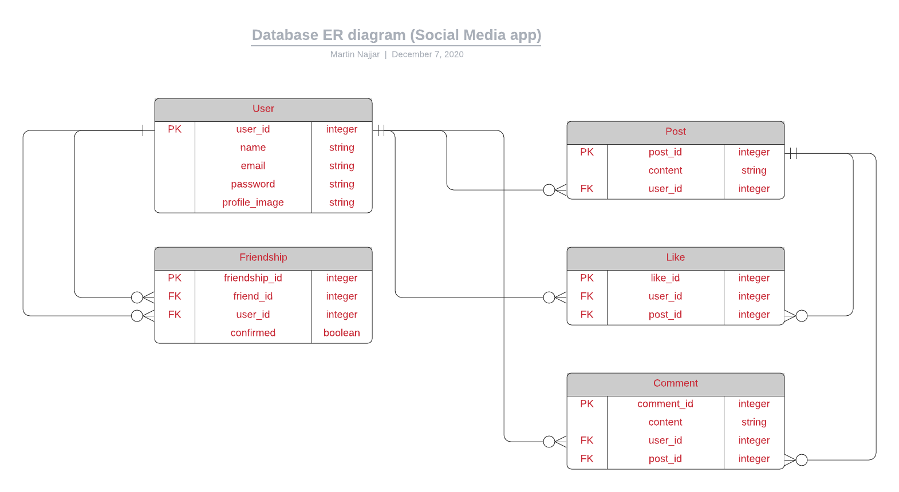
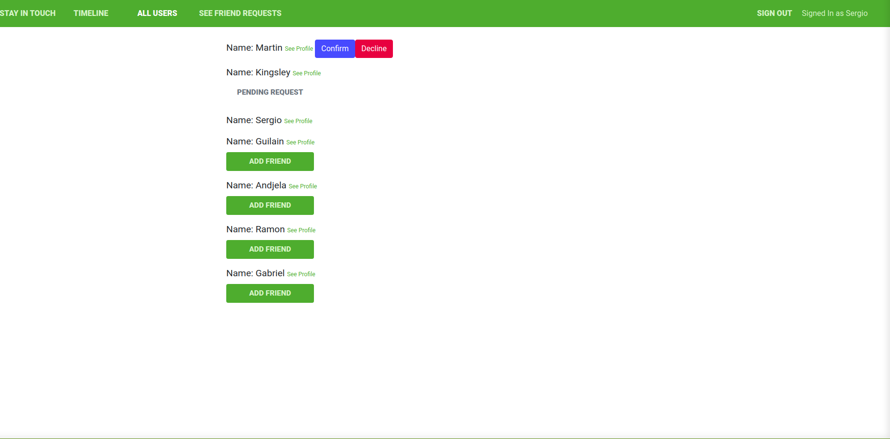

# Scaffold for social media app with Ruby on Rails

> This repo includes intial code for social media app with basic styling. Its purpose is to be a starting point for Microverse students.



<p align='center'><small>Database Diagram</small></p><br /><br />



<p align='center'><small>A user interface screenshot</small></p><br /><br />

## Built With

- Ruby v2.7.1
- Ruby on Rails v6.0.3.4

## Live Demo

(https://martinking-app.herokuapp.com/)

## Getting Started

To get a local copy up and running follow these simple example steps.

### Prerequisites

Ruby: 2.6.3
Rails: 5.2.3
Postgres: >=9.5

### Setup

Instal gems with:

```
bundle install
```

Install the required dependencies via:

```
yarn install --check-files
```

Or:

```
npm install
```

Setup database with:

```
   rails db:create
   rails db:migrate
```

### Github Actions

To make sure the linters' checks using Github Actions work properly, you should follow the next steps:

1. On your recently forked repo, enable the GitHub Actions in the Actions tab.
2. Create the `feature/branch` and push.
3. Start working on your milestone as usual.
4. Open a PR from the `feature/branch` when your work is done.

### Usage

Start server with:

```
    rails server
```

Open `http://localhost:3000/` in your browser.

**Note:** Sign in via Facebook may not work on your local machine because you don't have the access to the APP_ID and APP_SECRET.

### Run tests

```
    rpsec --format documentation
```

> Tests will be added by Microverse students. There are no tests for initial features in order to make sure that students write all tests from scratch.

### Deployment

TBA

## Author 1

- Github: [@martinnajjar12](https://github.com/martinnajjar12)
- Twitter: [@martin_najjar](https://twitter.com/martin_najjar)
- LinkedIn: [Martin Najjar](https://www.linkedin.com/in/martinnajjar12/)

## Author 2

- Github: [@githubhandle](https://github.com/Kingobaino1)
- Twitter: [@twitterhandle](https://twitter.com/ibehkingso)
- Linkedin: [linkedin](https://www.linkedin.com/in/kingsley-ibeh)

## 🤝 Contributing

Contributions, issues and feature requests are welcome!

Feel free to check the [issues page](issues/).

## Show your support

Give a ⭐️ if you like this project!

## Acknowledgments

Microverse and TheOdin Project
